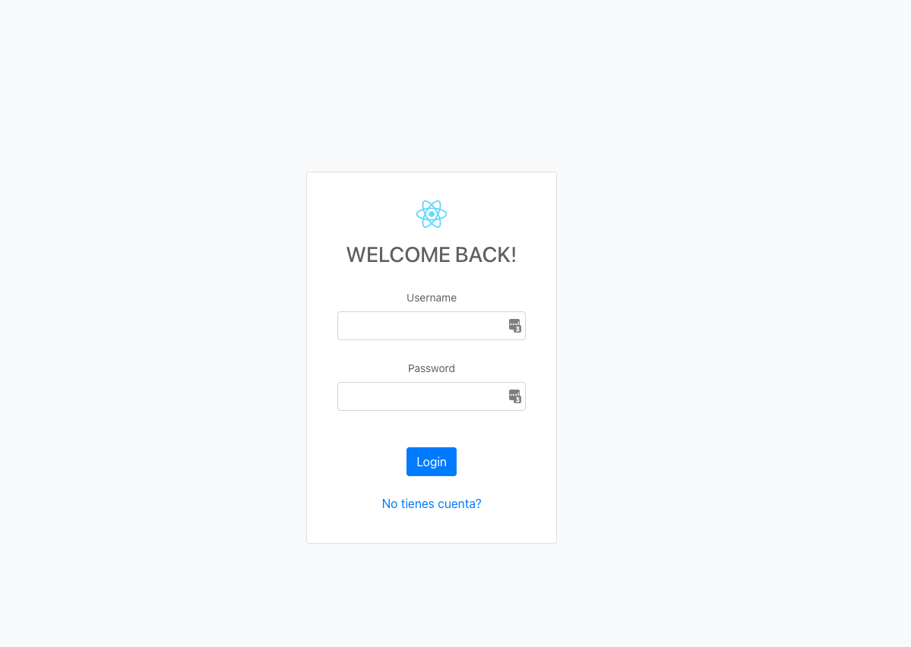
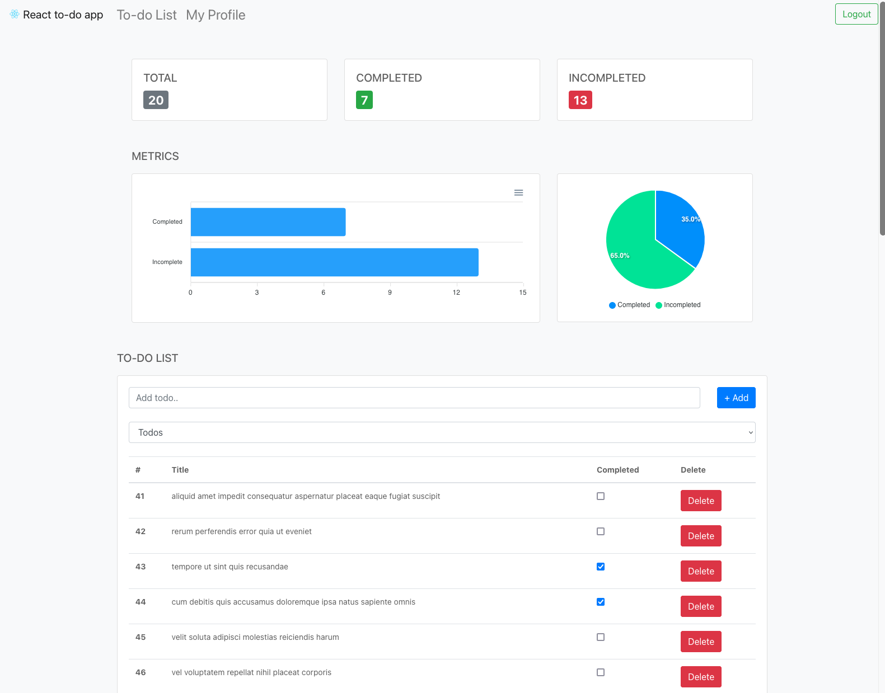

# To-do app (React)

Este repositorio contiene el código fuente de una aplicación de administración de tareas.
El propósito del mismo es poder aplicar los conocimientos vistos en el Taller de Frontend (A.T.I)

### Login screen



### Dashboard screen



## Technologies used :computer:

- [React > v18.x.x](https://reactjs.org/)
- [React router v6](https://reactrouter.com/docs/en/v6)
- [Redux / Redux Toolkit](https://redux-toolkit.js.org/)
- [Bootstrap css only](https://www.npmjs.com/package/bootstrap-css-only)
- [ApexCharts](https://apexcharts.com/react-chart-demos/)

Este proyecto fue creado mediante [create-react-app](https://create-react-app.dev/)

## Prerequisites

- Node - `^v16.0`

## Getting Started

### Installing :wrench:

Paso a paso de cómo poner en marcha la aplicación en desarrollo.

### Clone the repo

```bash
git clone https://github.com/MarLuz/ort-taller-frontend.git
```

```bash
cd React/todo-app
```

### Install dependencies

```bash
npm install
```

### Initialize the dev server

```bash
npm start
```

## Authors / Maintainers :man_technologist: :woman_technologist:

- **Martin Luz** - _Code owner_ - [MarLuz](https://github.com/MarLuz)
